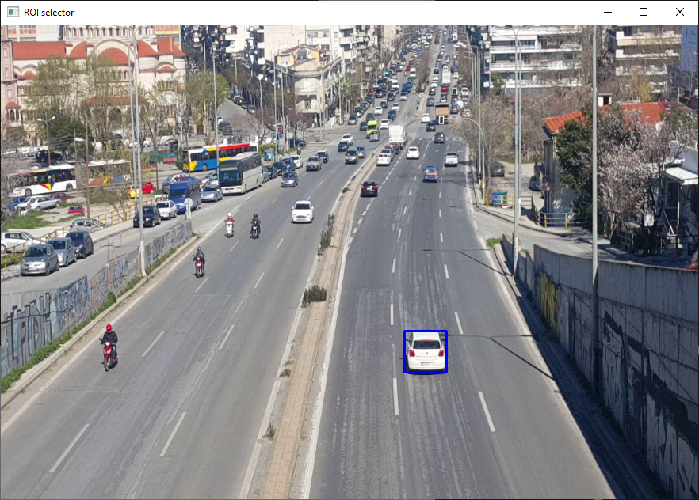
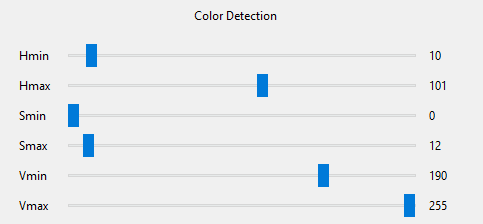

**Yêu cầu:**
- Python 3.x
- Opencv-python
- numpy
```
$ pip install opencv-python
```
- Pillow
```
$ pip install pillow
```
- Tkinter
```
$ pip install tk
```

- Nếu chưa có các thư viện trên thì chạy câu lệnh sau trong cmd:
```
$ pip install -r requiments.txt
```

**Cách chạy**:

1. Mở cmd cd đến thư mục chứa folder.
2. Tại cmd chạy câu lệnh:
    ```
    $ Scripts\activate
    ```
3. Rồi chạy câu lệnh:
    ```
    $ python -u main.py
    ```
    - Để chạy chương trình

**Cách sử dụng**

1. Nhấn `select video`:

    1.1 Chọn video cần theo dõ.

    1.2  Hoặc không cần chọn để sử dụng webcam
2. Chọn thuật toán cần sử dụng:
    
    2.1 `MeanShift` hoặc `CamShift`
    - Sau khi chọn thuật toán sẽ có một cửa sổ. kéo để chọn đối tượng

    </img>

    - Ấn Enter
    - Tại `Color Detection`

    </img>
    
    - Chỉnh các giá trị đến khi select được màu mong muốn.

    </img>
    
    - Ấn `Run`

    2.2 `Multiple instance learning (MIL)`
    - Kéo rồi chọn đối tượng.

    </img>

    - Ấn Enter
    - Ấn `Run`

    2.2 `Lucas-Kanade Optical Flow`
    - Click chuột vào Đối tượng cần theo dõi.
    - Ấn `Run`

    2.3 `Dense Optical Flow`
    - Ấn `Run`

- `Pause`: Để dừng Video
- `Clear`: Để xóa tất cả
- `Quit`: Để thoát chương trình
- `Continue`: Để tiếp tục Video